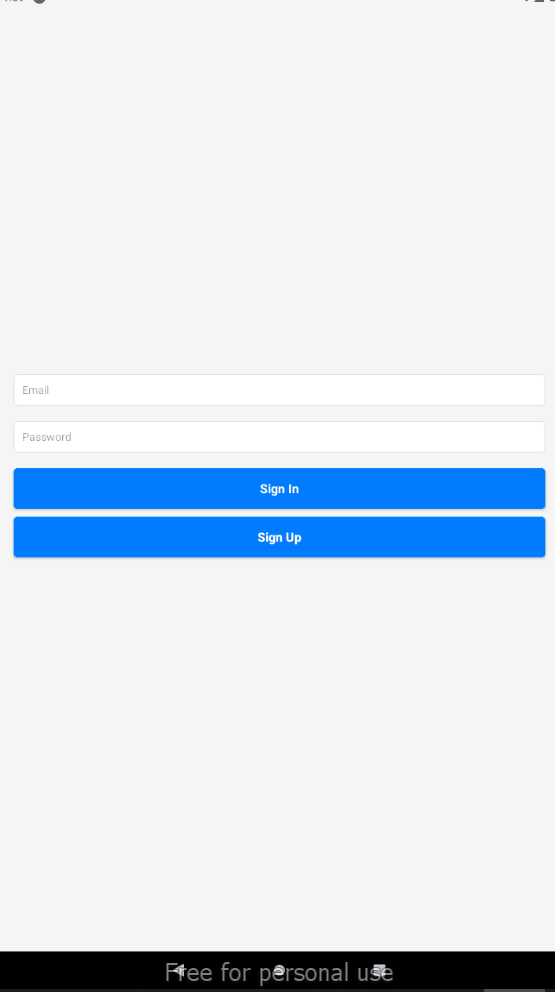
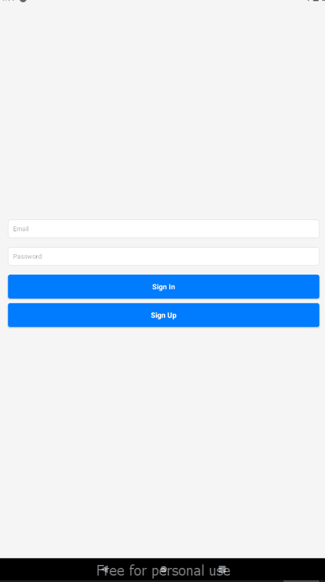
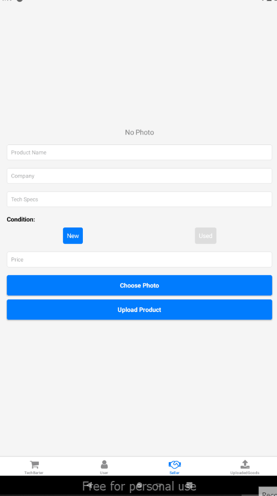
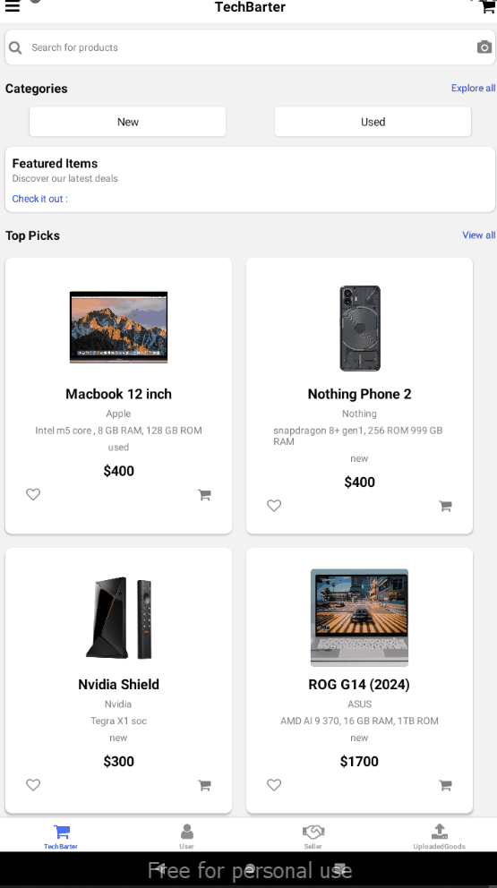

# Techbarter Android APP

An Ecommerce app that allows users to buy/sell used and New Products

## Demo

## SignUp



## SignIn



## Product upload + CRUD Demo



## New + Used Products




## Features
- SignUp as Buyer or Seller
- Buyers can buy products, Sellers can upload their own products to sell
- Sellers get access to full fledge product uploading interface, allowing them to update/delete any product they upload


## Installation

1. Clone the repository:
   ```bash
   git clone https://github.com/HardikKumariscoding/COMP-3123/tree/master/101410993_comp3123_labtest2

2.   Install dependencies:

        cd weather-app
        npm install

3. Run the app locally:        

        npm start


4. Open the app in your browser:

    Visit http://localhost:3000 to see the weather app in action. 


Technologies Used

    React
    OpenWeather API
    CSS/HTML